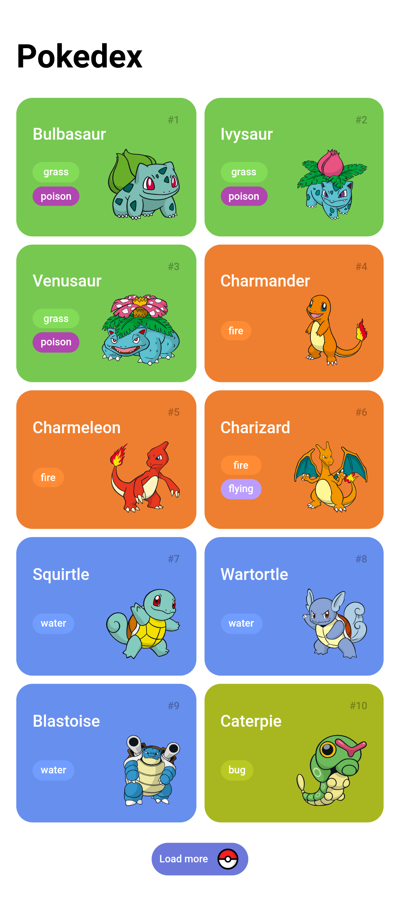
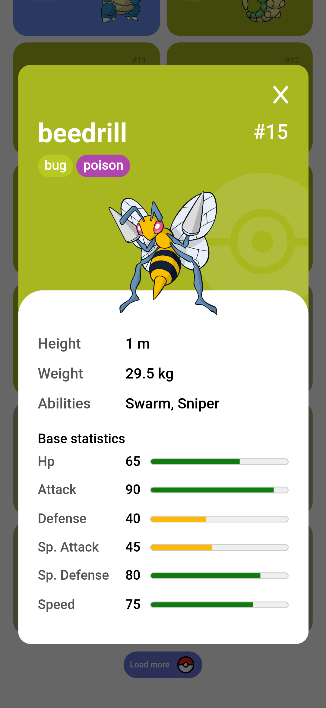

<div align="center">

# POKEDEX  
  
</div>
<div align="center">


 <a href="#-sobre-o-projeto">Sobre</a> •
  <a href="#-funcionalidades">Funcionalidades</a> •
 <a href="#-layout">Layout</a> • 
 <a href="#-como-executar-o-projeto">Como executar</a> • 
 <a href="#-tecnologias">Tecnologias</a> • 
 <a href="#-como-contribuir-para-o-projeto">Como contribuir</a> • 
 <a href="#-licença">Licença</a>
  
</div>

## 💻 Sobre o projeto
O projeto consiste em uma web page simulando uma Pokedex apresentando dados dos pokemons da primeira geração.

Este projeto foi desenvolvido como parte inicial do  Santander Bootcamp Fullstack 2023 - Java + Angular,  oferecido pela [DIO](https://dio.me) em conjunto com o banco Santander.

## 🧰 Funcionalidades
- [x] Listar cards de Pokemons com seus tipos;
- [x] Exibir dados sobre cada Pokemon;
- [x] Fazer páginação na listagem;

## 🎨 Layout
O layout de inspiração para o projeto está disponível no Dribble:<br />





## 🚀 Como executar o projeto
### Pré-requisitos
Para executar o projeto, você vai precisar ter instalado o [Git](https://git-scm.com). Além disto é bom ter um editor para trabalhar com o código como [VSCode](https://code.visualstudio.com/).

### Clonando o repositório
```bash
# Clone o repositório
$ git clone git@github.com:eduhaag/Pokedex.git
```
Agora basta abrir o arquivo *index.html* no navegador de sua preferência.


## 🛠️ Tecnologias
- **HTML**;
- **CSS**;
- **Javascript**;
- **[PokeAPI](https://pokeapi.co/)** - Api para obtenção dos dados dos Pokemons;
-


**Utilitários**
- Icones: **[Font Awesome](https://fontawesome.com/)**;
- Editor:  **[Visual Studio Code](https://code.visualstudio.com/)**;
- Fontes: **[Roboto](https://fonts.google.com/specimen/Roboto)**.

## 💪 Como contribuir para o projeto
1. Faça um **fork** do projeto.
2. Crie uma nova branch com as suas alterações: `git checkout -b my-feature`
3. Salve as alterações e crie uma mensagem de commit contando o que você fez: `git commit -m "feature: My new feature"`
4. Envie as suas alterações: `git push origin my-feature`

## 📝 Licença
Este projeto está sobe a licença MIT.
